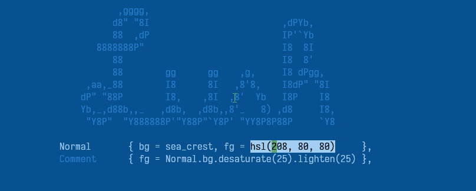

Lush 
====

Lush is a colorscheme creation aid, written in Lua, for Neovim.

Lush lets you define your scheme as a *mini-dsl*, provides HSL *colour
manipulation* aids, and gives you *real time* feedback of your changes.

Lush themes can be exported to plain vimscript for distribution (or escape),
and they can also be *imported* to other lua/vimscript files to access color
data.

**Lush is relatively stable and usable, but it still needs improvement. Some
aspects of the API may change.**

Installation and Getting Started
--------------------------------

Lush is:

  - **Neovim only**
  - requires **0.5.0** or greater.
  - "true color" only

Install via any package mangement system, for example, vim-plug:

```vim
Plug 'rktjmp/lush.nvim'
```

There are two interactive tutorials provided,

- `:LushRunQuickstart` which will give you a few-minute overview of Lush's
  features. (`lush_quick_start.lua` in the examples folder.)

- `:LushRunTutorial`, a more in-depth guide through various ways to apply Lush.
  (`lush_tutorial.lua` in the examples folder).

*Warning, saving the quickstart and tutorial file may prevent future `git pull`
plugin updates from working!, you may have `git restore` to clear any conflicts! Sorry!*

A Lush theme template is avaliable in the examples folder, as well as other
examples for various topics (Lightline, dependecy injection, etc).

Table of Contents
-----------------

Lush broadly has 3 components,

- [A HSL color manipulator](#hsl-colors),
- The [lush-spec parser and compiler](#lush-spec), and
  - The [lush-spec spec](#lush-spec-spec),
  - and [additional information](#additional-information) about lush-specs,
- [Lushify](#lushify), a buffer highlighting and hot-reload tool.

For a usage example, see the quickstart, tutorial and examples folder.

HSL Colors
----------

The [HSL color](https://www.w3.org/wiki/CSS3/Color/HSL) manipulator can be
accessed via `require('lush').hsl`.  It may also be included in other modules
via `require('lush.hsl')`.

You can create HSL colors by providing hue, saturation and lightness values,
or providing a hexidecimal string.

```lua
color = hsl(0, 100, 50) -- equivilent to rgb(255,0,0) elsewhere
hex_color = hsl("#FF0000") -- hex_color == color
```

It provides multiple methods for manipulating a color. All functions are pure,
always returning new colors and leaving the originals unmodified. Functions
can be chained.

There are 3 main operations you may want to perform:

- Rotate a hue.
- Saturate (or desaturate) a color.
- Lighten (or darken) a color.

Hue/rotate values are wrap around 0-360 degrees, lightness and saturations
are clamped between 0-100.

HSL provides the following functions to achieve these operations:

- `color.rotate(n)`: rotate `n` degrees around the color wheel.
  - `color.rotate(180)` gives you `color`'s complementary tone.
  - `color.rotate(40)` gives you an analogous color.
  - `color.rotate(-40)`, as above but in the opposite direction.
  - `color.rotate(120)` one part of the triad.
  - `color.rotate(-120)`, the other part of the triad.

- `color.saturate(n)`: increase a colors saturation by `n` percent.
  - `saturate` has a mirrored function, `desaturate`.
    - `saturate(-n) == desaturate(n)`

- `color.lighten(n)`: increase a colors lightness by `n` percent.
  - `lighten` has a mirrored function, `darken`.
    - `lighten(-n) == darken(n)`

Note that these functions are *relative* to the color space, not simply
additive. That is:

```lua
color = hsl(0, 50, 50)
color.saturate(10) -- adds 10% saturation to 50
```

If you wish to add an absolute amount to a color, you can use the `abs_`
prefixed functions (most of the time you should use relative ajustments):

- `color.abs_saturate(n)` (and `abs_desaturate`)
- `color.abs_lighten(n)` (and `abs_darken`)

Behaves as:

```lua
color = hsl(0, 50, 50)
color.abs_saturate(10) -- adds 10 to 50
```

Rotate does not have an `abs_` prefixed function, *it always operates
absolutely*.

All operations have shortcut aliases:

- `ro`: `rotate`
- `sa`: `saturate`
- `de`: `desaturate`
- `li`: `lighten`
- `da`: `darken`
- `abs_sa`: `abs_saturate`
- `abs_de`: `abs_desaturate`
- `abs_li`: `abs_lighten`
- `abs_da`: `abs_darken`

You may also directly set a HSL value via:

- `hue(n)`
- `saturation(n)`
- `lightness(n)`

And access members with,

- `color.h`: Hue.
- `color.s`: Saturation.
- `color.l`: Lightness.

Finally, HSL colors can be coerced into a hex string, either by:

- concatenation: `color .. "" == "#......"`
- `.hex` member: `color.hex == "#......"`
- `tostring(c)`: `tostring(color) == "#......"`

The following is an example of of all these concepts:

```lua
local hsl = require('lush').hsl                 -- include the module
local red = hsl(0, 100, 50)                     -- define a color
local light_red = red.lighten(20)               -- modify
local orange = red.hue(20)                      -- set
local sum_hues = red.h + light_red.h + orange.h -- access
local chained_compliment = red.ro(180)          -- chain via aliases
                              .da(30)
                              .sa(10)
print(red)                                      -- as string "#FF0000"
```

Lush Spec
---------

You define your color scheme by writing a lush-spec, which can leverage the
HSL module and be exported to other parts of Neovim. Lush will expose your
lush-spec as a Lua module.

The starter files, `examples/lush_quick_start.lua` and
`examples/lush_tutorial.lua` provide an interactive tutorial on how to create a
lush-spec.

The basic definition of a lush-spec is, a lua table which defines your
highlight groups, by name, and their associated color and decoration details.

The advantage of using Lush and a lush-spec is that you're able to define
groups from previous groups, and make modifications on those groups to easily
define relational colours between groups.

If that sounded confusing, it's much simpler in practice.

Here's a very simple lush-spec:

```lua
-- cool_name/lua/lush_theme/cool_name.lua
-- require lush
local lush = require('lush')

-- lush(), when given a spec, will parse it and return a table 
-- containing your color information.
-- We should return it for use in other files.
return lush(function()
  return {
    -- Define what vims Normal highlight group should look like
    Normal { bg = lush.hsl(208, 90, 30), fg = lush.hsl(208, 80, 80) },
    -- And make whitespace slightly darker than normal.
    -- Note you must define Normal before you try to use it.
    Whitespace { fg = Normal.fg.darken(40) },
    -- And make comments look the same, but with italic text
    Comment { Comment, gui="italic" },
    -- and clear all highlighting for CursorLine
    CursorLine { },
  }
end)
```

```vim
" cool_name/colors/cool_name.vim
" yes, unfortunately you still have to write some vimscript
set background=dark
let g:colors_name="cool_name"
" you could detect background == dark || light here and require
" different files
lua require('lush')(require('lush_theme.cool_name'))
```

That's essentially all you need to know to write a lush-spec. The starter
files provide a deeper example and some tips and tricks.

Lush-spec Spec
--------------

Lush supports the following group defintions:

**Direct Defintion**

*Used to define a stand alone highlight group, see `:h highlight`.*

Supports the following keys:

- `fg`: sets the `guifg` property of a Vim highlight group.
- `bg`: sets the `guibg` property of a Vim highlight group.
- `gui`: sets the `gui` property of a Vim highlight group.
- `sp`: sets the `guisp` property of a Vim highlight group.
- `lush`: a namespace to save arbitary data to a group. Is not exported to the
          final highlight by may be accessed in the lush-spec or the parsed-lush-spec.

Constraints:

- `value` may be any Lua type which will concatenate with a string.
- `value` may be derived from previously defined group properties.
- All unspported keys are dropped.
- Group name is CamelCase by convention, but may be any string beginning with
- Group names may not be `ALL`, `NONE`, `ALLBUT`, `contained` or `contains`,
  this is a vim constraint.
  an alpha character.
- `font` key currently unsupported, create an issue if you would like to see this.

Syntax:

```lua
GroupName { fg = value, bg = value, gui = value, sp = value },
```

**Linked Group**

*Used to define a highlight link. see `:h hi-link`*

Supported keys:

N/A.

Constraints:

Linked group must be defined before the link definetion.

Syntax:

```lua
LinkedGroup { GroupName },
```

**Inherited Group**

*Used to define a new highlight group, with properties inherited from another
group.*

This is logically similar to a *Linked Group*, except you wish to define new
keys, or redefine old keys.

Supported keys:

See *Direct Definition*.

Constraints:

- Only one parent group may be specified and it must be the first value in the
  group defintion.
- Inherits constraints of *Direct Definition*

Syntax:

```lua
InheritedGroup { Parent, gui = "bold" },
```

Additional Information
----------------------

#### Converting an Existing Theme to Lush

Currently there isn't an built in automated method for converting an
existing theme to Lush, but you can redirect all your current highlights to a
register, paste that into a buffer then construct some macros to reformat.

```vim
:redir @z
:highlight
" in buffer
"zp
```

#### Why `return ...`?

In the lua file, we call `lush(lush-spec)`, which will parse the given
lush-spec, then it will return your theme as lua a table (aka: a
parsed-lush-spec) You should return this table from your lua theme file to
allow other modules to `require(a_lush_spec_file)` and access your themes
colour data.

In the vim file, we can call `lush(parsed-lush-spec)` to clear any existing
highlighting and apply our parsed lush-spec.

#### Why `lua/lush_theme/`?

Lua doesn't have any strict namespacing. Because anything in a plugins `lua/`
directory becomes avaliable as a module in vim, it's advised to nest your
theme inside a `lush_theme` folder, essentialy providing a namespace for all
lush themes to exist in. This is to avoid any collisions between themes and
other modules.

This isn't a strict rule enforced in anyway by Lush, simply a recommendation.

#### Linters

You will likely get warnings from linters while writing a lush-spec,
specifally around "undefined globals". Most of these warnings can be safely
ignored, you may wish to disable LSP/Linters temporarily when working on a
theme.

#### Dependency Injection (Why can't I access math.random?)

Lush-specs are executed a bare environment, so they don't have access to lua
globals or other modules. However, they are also written as closures, so they
do have access to any local level variables in the theme file.

This means if you want to access a global module, you simply have to bind it
to a local scope variable.

```lua
-- all these local variables can be accessed in the spec closure
local weather = require('local_weather')
local harbour = require('lush_theme.harbour')
local math = math

lush(function()
  return {
    -- set fg color depending on rain or snow
    Normal  { fg = hsl(weather.hex_color_for_current_weather) },
    -- set comment color from normal fg, but set to a random
    -- analogous-ish color
    Comment { fg = Normal.fg.ro(math.random(-60, 60)) },
    -- we can even access other theme data
    -- automatic theme inheritance and extension is WIP
    CursorLine { fg =  harbour.CursorLine.fg, bg = harbour.CursorLine.bg },
  }
end)
```

#### Exporting From Lush

If you wish to move your theme away from lush, or export it for use in Vim,
you can run the following lua code:

```vim
:lua require('lush').export_to_buffer(require('lua-module-theme-name'))
```

Your Lush theme will be exported to a new floating window, as a collection of
Vim higlight commands.

Note that the name you specify is the name of the lua module in which your
theme was defined. In the above short-example, you would run

```vim
:lua require('lush').export_to_buffer(require('lush_theme.cool_name'))
```

#### Manual Toolchain

If desired, you can manually parse -> compile -> apply your lush-spec.

```lua
local lush = require('lush')
local parsed = lush.parse(function() return { ... } end)
local compiled = lush.compile(parsed, {force_clean = true })
lush.apply(compiled)
```

`compile` accepts a secondary `options` table with the following options:

- `force_clean`: `true` or `false`, prepends commands to clear and reset
  highlighting.

Lush.ify
-------

Lush.ify will provide automatic, realtime highlighting of any `hsl(...)` calls,
as well as highlighting any groups in your lush-spec with their appropriate
colors and decorations.

To use lushify, open your theme lua file and run

```vim
:lua require('lush').ify()
```

Now changes you make to a colorscheme are reflected in real time. See the two
starter files for more information and a demostration.

Performance of lush.ify is somewhat dependent on your hardware and probably
more specifally, your terminal. Some terminals are better than others at
rendering color changes fast.

#### Lush.ify Incompatibilities

**Easy Motion**

Activating the easy motion plugin *in a lush.ify'd buffer* will cause a lot of
syntax errors. This is because easy-motion directly modifies the buffer to
display its "jump keys", which we try to parse.

It is not recommened you activate easy motion in a lush.ify'd buffer.

**Lightline**

While Lightline can be styled through Lush, realtime updating has some
caveats and performance may be less than optimal due to vimscripts
performance.

See `examples/lightline-one-file` and `examples/lightline-two-files` for
guidance. Generally, if real time performance with lightline is problemantic,
I would recommend developing your theme first, then disabiling lush.ify with
`:e!` in the buffer and applying your changes via `:luafile %`.

The two examples go into some more detail regarding this method.

Bugs or Limitations
-------------------

- Sometimes line group and hsl highlighting may appear out of sync if you've
  applied undo/redo chains to a lush.ify'd file. Generally typing more into the
  buffer will fix these issues as the highlighter resyncs with the buffer
  state.

- You may find some elements don't update in real time (LSP sign column for
  example). This is a side effect of colours are applied to those elements,
  only as they are created (I believe).
  The group name in your lush-spec should update to let you see how it will
  look when your theme is loaded.

- Lush.ify'd `hsl()` and group name highlight may sometimes be obscured by
  CursorLine highlighting. If this is a problem, you can set CursorLine to an
  empty definition or disable the cursor line with `set nocursorline`.

Todo / Future ideas
-------------------

**Automatic Property Inferrence**

Would allow for syntax like:

```lua
Comment { Normal, gui = "italic" }, -- automatically detect fg, bg and apply
CursorLine { fg = Normal, bg = Visual } -- automaticlly infer appropriate key
```
