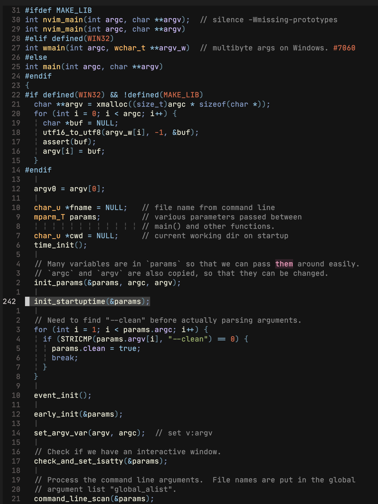
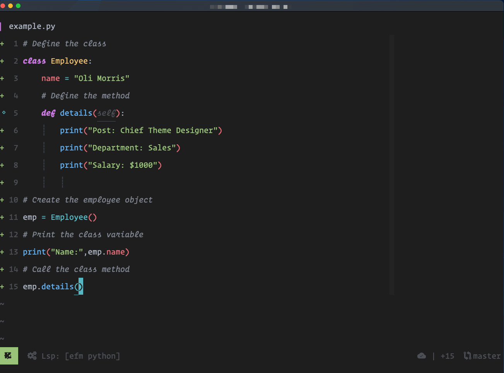
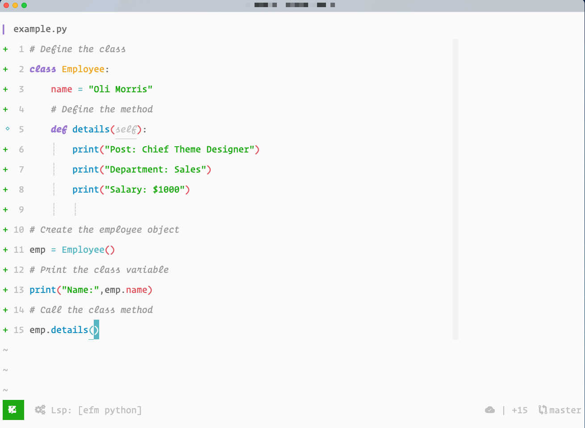
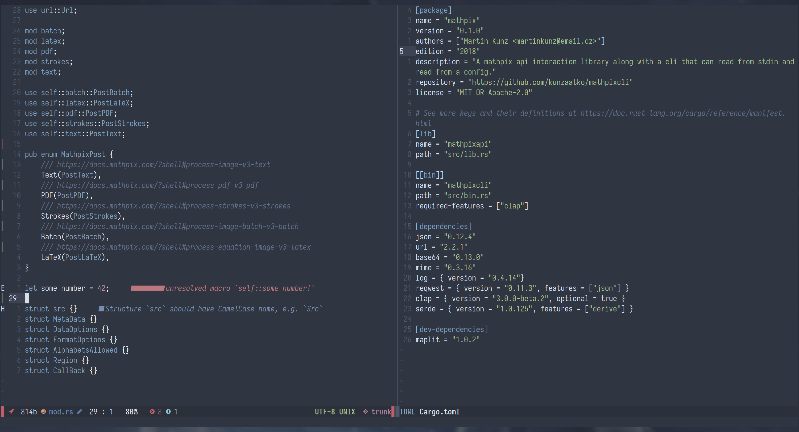
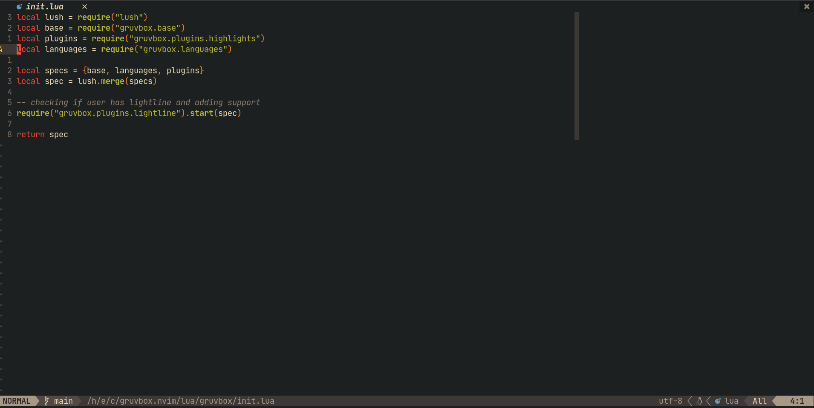
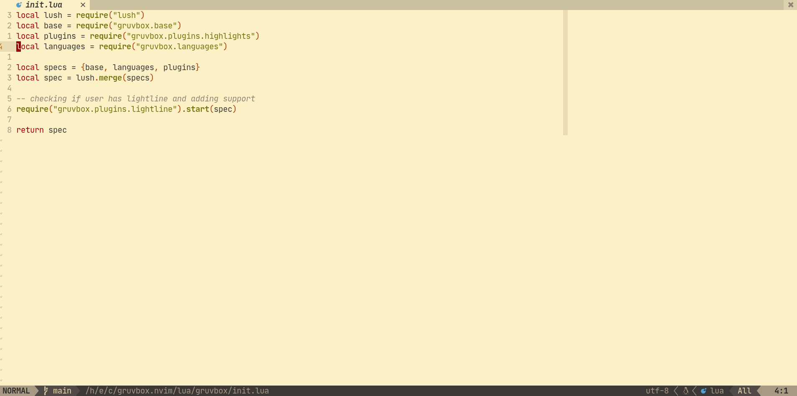

Made with Lush
==============

You can use Lush with any theme on this page to adjust or extend them. See
[advanced
usage](https://github.com/rktjmp/lush.nvim#spec-extension-and-merging) in the
readme or `:h lush-extending-specs` for more details. To add your theme to this list, see [Adding your theme to the
list](#adding-your-theme-to-the-list) at the bottom of this file.

Themes are sorted alphanumeric by theme name.

Lush Community Themes
---------------------

### jellybeans-nvim

[metalelf0/jellybeans-nvim](https://github.com/metalelf0/jellybeans-nvim)

Lua module: `require('lush_theme.jellybeans-nvim')`

Usage: `colorscheme jellybeans-nvim`

A port of the jellybeans theme.



---
### onedark.nvim

[olimorris/onedark.nvim](https://github.com/olimorris/onedark.nvim)

Lua module: `require('lush_theme.onedark_nvim')`

Usage:

```lua
vim.o.background = 'dark'
vim.g.colors_name = 'onedark_nvim'
```

My personal One Dark port for Neovim with Treesitter and LSP support, dark/light versions and lots of plugins.





---

### nord.nvim

[kunzaatko/nord.nvim](https://github.com/kunzaatko/nord.nvim)

Lua module: `require("nord-nvim")`

Usage: `colorscheme nord`

Port of the popular [nord-vim](https://github.com/arcticicestudio/nord-vim) theme to `lush`. The `trunk` branch is the group for group copy with all options from the original implemented and the `colourful` branch is my own tweaked version.



---

### gruvbox.nvim

[npxbr/gruvbox.nvim](https://github.com/npxbr/gruvbox.nvim)

Lua module: `require("gruvbox")`

Usage: `colorscheme gruvbox`

A port of gruvbox community theme to lua with treesitter support!




---

Adding your theme to the list
-----------------------------

Submit a pull request with:

- [x] The theme details template filled out (see below)
- [x] At most 2 images (optional but recommended):
  - PNG format
  - Reasonable size (i.e. not a 4k res 30mb file)
  - Filenames follow the format:
    `<gh_username>_<gh_reponame_with_dots_as_underscores>_[1|2].png` and are in
    the `made_with_lush` directory (alongside this file)
- [x] Squash your commits with the message "`Add <theme name> to made_with_lush`"
  - ("`Update <theme_name> in made_with_lush`" if you are submitting a patch)

Details template:

```markdown
### <theme_name>

[<gh_username/gh_reponame> or simliar service](https://github.com/user/repo)

Lua module: `require(<what you require in your colours/vim file, probably 'lush_theme.theme_name'>)`

Usage: `colorscheme theme_name`

<(optional) max 50ish (be reasonable) word description of theme or features (plugins, terminal themes, etc).>


---
```
